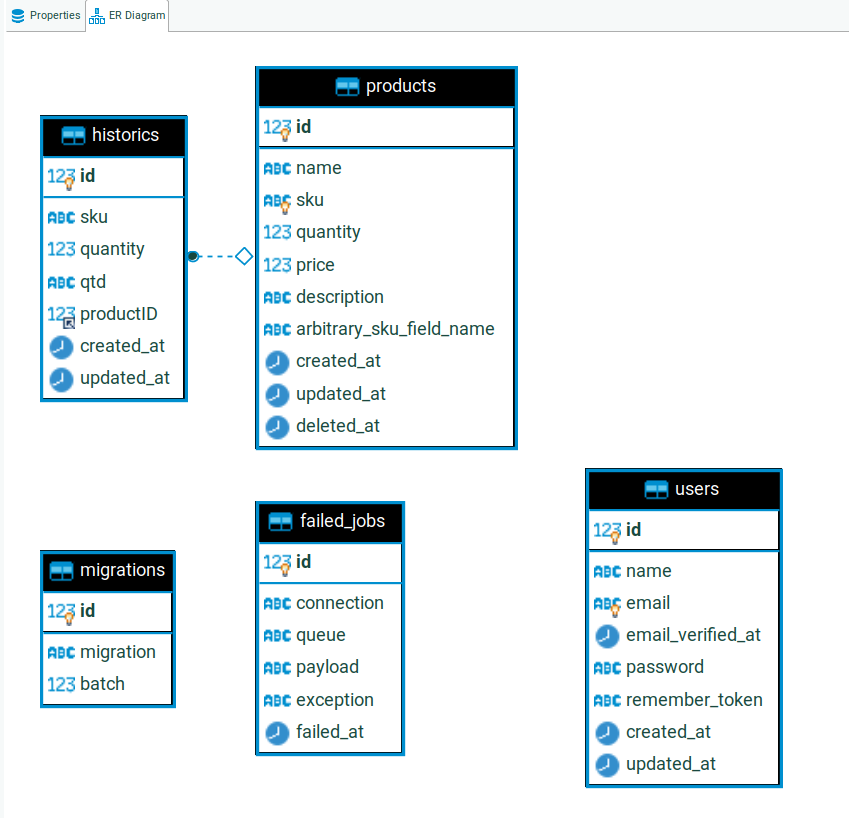

<p align="center"></p>

> Usei bitbucket

# Iniciando o projeto

- SO Linux Ubuntu 20.04
- PHP 7.4.27 
- laravel 7.0

Iniciei com `git flow init`

`sudo chmod -R 777 storage`

> Nome do database: app_4bb61698
- CREATE DATABASE `app_4bb61698` /*!40100 COLLATE 'utf8mb4_general_ci' */;

### Comandos iniciais:
```
composer install
```

#### Obs: Renomear o arquivo .env.example caso não crie automatico.

# Para gerar a key da aplicação (.env)
`php artisan key:generate`

# Executa a criação das migrations
`php artisan migrate`

# Rollback - migrations (se necessário)
`php artisan migrate:rollback`

# dicas uteis
```
    php artisan key:generate
    php artisan cache:clear
    php artisan route:clear
    php artisan config:clear 
    php artisan view:clear 
```

### POSTMAN
```
/postman_collection.json
```

### Rotas
<table>
  <tr>
    <th>Tipo</th>
    <th>Rota</th>
    <th>Método</th>
  </tr>
  <tr>
    <td>GET | HEAD</td>
    <td>api/history</td>
    <td>history.index</td>
  </tr>
  <tr>
    <td>GET | HEAD</td>
    <td>api/products</td>
    <td>products.index</td>
  </tr>
  <tr>
    <td>POST</td>
    <td>api/products</td>
    <td>products.store</td>
  </tr>
  <tr>
    <td>GET | HEAD</td>
    <td>api/products/{product}</td>
    <td>products.show</td>
  </tr>
  <tr>
    <td>PUT | PATCH</td>
    <td>api/products/{product}</td>
    <td>products.update</td>
  </tr>
  <tr>
    <td>DELETE</td>
    <td>api/products/{product}</td>
    <td>products.destroy</td>
  </tr>
</table>

## Usei para teste um gerador de SKU

`binary-cats/laravel-sku`

# Docker
> Caso queiram usar docker para da o start, criei um dockerfile basico, que se inicia pelo docker-compose.
## Comandos basicos para iniciar o docker-compose
```docker-compose up -d```
## verificar endereço de ip dos containers
```docker inspect -f '{{.Name}} - {{range .NetworkSettings.Networks}}{{.IPAddress}}{{end}}' $(docker ps -aq)```
## dentro do container
```docker exec -it app sh```
### dentro container vc pode encontrar via cd /var/www/app-4bb61698, e alterar o ip do .env via 'vim'


## stop docker
`docker-compose down -v`

- https://bitbucket.org/cpdrenato/app-4bb61698/